# DesignForge
## Technical Explanation of the B.Tech Capstone Project

**Project title:** AI-Driven Multi-Agent Framework for Automated Requirements-to-System Design  
**Project type:** Final-year B.Tech Computer Engineering capstone with Cybersecurity Honors  
**Application name:** DesignForge  
**Document purpose:** Technical explanation for project review, report preparation, and viva presentation

---

## 1. Project Overview

DesignForge is an AI-assisted software architecture workbench. It accepts informal software requirements written in natural language and transforms them into a structured backend system design.

The generated design can contain:

- Functional requirements
- Non-functional requirements
- Ambiguities and possible conflicts
- Architecture recommendations
- Architecture trade-offs
- Components and dependencies
- Database entities and fields
- REST API endpoints
- Requirement traceability links
- Critique findings
- Deterministic quality scores
- Mermaid-based diagrams
- A dynamically generated Software Requirements Specification document

The main purpose of the project is not simply to ask an LLM to generate an architecture. The main purpose is to divide the design task among specialized agents and independently verify whether the generated design is complete, traceable, and internally consistent.

The system is designed for backend architectures of web applications. Its scope includes REST APIs, GraphQL-oriented services, relational and NoSQL data stores, modular monoliths, and microservice architectures.

---

## 2. Problem Statement

Software requirements are frequently written in an informal and incomplete form. They may contain vague phrases such as fast, secure, scalable, or user-friendly without measurable definitions. They may also omit important architecture information, such as authentication, auditability, data consistency, or expected scaling behavior.

Converting these requirements into a system design normally requires an experienced software architect. Small teams and student projects may not have access to that expertise. As a result, design problems are often discovered later during implementation.

A conventional single-prompt AI system has several weaknesses:

- It may combine requirement analysis and architecture selection into one opaque response.
- It may overlook ambiguous requirements.
- It may introduce components that are not required.
- It may produce endpoints that refer to nonexistent database entities.
- It may fail to connect design decisions to the original requirements.
- It may praise its own design without performing an independent review.

DesignForge addresses these weaknesses through specialized agents, structured outputs, architecture debate, independent critique, deterministic validation, and a bounded revision loop.

---

## 3. Project Objectives

### 3.1 Primary objective

To develop a multi-agent generative AI system that converts informal backend requirements into an explainable, traceable, and structurally validated system design.

### 3.2 Supporting objectives

1. Extract functional and non-functional requirements from natural language.
2. Detect ambiguity and uncertainty before architecture decisions are made.
3. Compare alternative architecture choices instead of using a fixed default.
4. Generate components, dependencies, entities, and API contracts.
5. Maintain links between requirements and design elements.
6. Use an independent critic to challenge the generated design.
7. Use deterministic code to check objective structural properties.
8. Revise the design when severe problems are detected.
9. Generate an SRS document dynamically from the current run.
10. Support execution on a CPU-only machine through hosted LLM APIs.
11. Provide reproducible demo behavior when a hosted provider is unavailable.
12. Establish measurable evaluation criteria instead of relying only on subjective impressions.

---

## 4. Scope of the Project

### 4.1 Included scope

DesignForge covers the early requirements-to-architecture phase of backend system development.

The system supports:

- Natural-language requirement input
- Requirement classification
- Ambiguity identification
- Architecture comparison
- Modular monolith recommendations
- Microservice recommendations when justified
- Relational database recommendations
- NoSQL database recommendations
- Component and dependency design
- Entity and field design
- REST endpoint design
- Requirement traceability
- Automated structural validation
- LLM-based architecture criticism
- Revision requests
- Mermaid diagram generation
- Dynamic SRS generation
- Browser-based demonstration

### 4.2 Excluded scope

The following capabilities are outside the current project boundary:

- Generating complete production source code for the target application
- Automatically deploying the target application to cloud infrastructure
- Proving that an architecture is production-correct
- Performing formal security certification
- Training a new large language model
- Hosting a large language model locally
- Automatically executing database migrations
- Replacing human architecture review
- Guaranteeing regulatory or legal compliance

---

## 5. Novelty and Academic Contribution

The novelty of DesignForge lies in the controlled interaction between multiple specialized reasoning roles.

A conventional system generally follows this pattern:

**Requirements to one generated design**

DesignForge follows a more rigorous process:

**Requirements to analysis to competing architecture proposals to adjudication to detailed design to independent critique to deterministic validation to revision**

The academic contribution includes:

- Multi-agent decomposition of the requirements-to-design task
- Parallel architecture advocate and challenger roles
- Architecture adjudication based on competing proposals
- Schema-constrained outputs
- Explicit requirement-to-design traceability
- Independent red-team critique
- Deterministic quality gates
- Dynamic generation of technical documentation
- Reproducible fallback execution
- A framework suitable for baseline comparison and ablation studies

The project can therefore be presented as an engineering and evaluation framework, rather than only as a chatbot interface.

---

## 6. High-Level System Architecture

The system consists of five major layers.

### 6.1 User interface layer

The React frontend provides:

- Requirements editor
- Agent execution status
- Architecture decision view
- Architecture debate view
- Component and API view
- Data model view
- Critique report
- SRS document view
- System design view
- Change-request page
- Mermaid diagram preview
- Generated Markdown source viewer

### 6.2 API layer

The FastAPI backend exposes HTTP endpoints for:

- Health checking
- Complete design generation
- Stage-level requirement analysis
- Natural-language change requests

The API validates input and returns a structured run response.

### 6.3 Orchestration layer

LangGraph controls the sequence of agent execution and maintains the shared pipeline state.

The orchestration layer is responsible for:

- Passing validated data between agents
- Executing independent architecture agents concurrently
- Routing the result to the adjudicator
- Sending the design to the critic
- Looping back when revision is necessary
- Limiting the number of revisions
- Returning a final accepted or flagged design

### 6.4 LLM provider layer

The provider adapter hides the details of the hosted model API from the agents.

The current provider configuration supports Google Gemini through HTTP requests. The design also permits future providers such as Groq or another hosted model service.

### 6.5 Deterministic evaluation layer

The rule engine executes locally and independently of the LLM. It checks measurable properties such as:

- Requirement coverage
- Traceability tags
- API entity references
- Component edge references
- Dependency graph validity
- Over-engineering indicators

This separation makes the evaluation more defensible during a viva.

---

## 7. Multi-Agent Architecture

### 7.1 Requirement Analyst

The Requirement Analyst is responsible for understanding the raw user input.

Its responsibilities are:

- Segmenting the input into requirement statements
- Classifying statements as functional or non-functional
- Assigning stable identifiers
- Estimating confidence
- Detecting vague language
- Identifying requirements that need measurable acceptance criteria
- Preserving links to the original text

The analyst does not make architecture decisions. This boundary is important because architecture should be based on a structured requirement model rather than on an unprocessed paragraph.

### 7.2 Architecture Advocate

The Architecture Advocate proposes a design that satisfies the requirements with the lowest reasonable operational complexity.

It evaluates:

- Team size assumptions
- Transactional consistency
- Deployment complexity
- Data ownership
- Scaling requirements
- Latency requirements
- Security requirements
- Maintenance effort

The advocate may recommend a modular monolith when the requirements do not justify distributed services.

### 7.3 Architecture Challenger

The Architecture Challenger independently questions the simplest proposal.

It searches for:

- Hidden scaling requirements
- Missing security boundaries
- Strong consistency requirements
- Independent deployment needs
- Fault isolation concerns
- Potential bottlenecks
- Unnecessary complexity
- Missing architecture components

The challenger is deliberately separated from the advocate to reduce confirmation bias within a single generated response.

### 7.4 Architecture Adjudicator

The Adjudicator compares the advocate recommendation with the challenger objections.

It selects the final architecture by considering:

- Requirement satisfaction
- Technical risks
- Complexity
- Scalability
- Security
- Data consistency
- Team and deployment assumptions

The adjudicator also records the rejected alternative and explains why it was not selected.

### 7.5 Component and API Designer

The Component and API Designer translates the selected architecture into implementation-oriented artifacts.

Its responsibilities are:

- Defining components
- Defining component dependencies
- Defining data entities
- Defining fields and types
- Defining relationships
- Defining REST endpoints
- Assigning component ownership to endpoints
- Adding requirement identifiers to design elements
- Preserving architectural traceability

### 7.6 Red-Team Critic

The Red-Team Critic attempts to identify weaknesses in the generated design.

It reviews:

- Missing requirements
- Untraceable components
- Unjustified services
- Invalid database references
- Security gaps
- API inconsistencies
- Scaling risks
- Conflicting design decisions
- Missing acceptance criteria

The critic is advisory from an AI perspective, but deterministic rule failures always remain binding.

### 7.7 Revision Controller

The Revision Controller determines whether the design is complete enough to return to the user.

A revision is requested when:

- A high-severity issue exists
- A critical consistency issue exists
- A requirement remains unmapped
- The configured revision limit has not been reached

The critic feedback is passed back to the design stage so that the next version can address the identified issues.

---

## 8. Parallel Processing Strategy

Not all agents are dependent on each other.

The Requirement Analyst must finish before architecture reasoning begins. However, the Architecture Advocate and Architecture Challenger can work independently on the same requirement set.

Therefore, they are executed in parallel.

This improves performance because:

- The advocate does not wait for the challenger.
- The challenger does not wait for the advocate.
- Both use the same structured requirements.
- The adjudicator receives both results afterward.

The dependency structure is:

| Stage | Dependency |
|---|---|
| Requirement analysis | Raw requirements |
| Advocate | Structured requirements |
| Challenger | Structured requirements |
| Adjudicator | Advocate and challenger results |
| Component/API design | Adjudicated architecture |
| Critique | Complete design and requirements |
| Revision | Critique result |
| Final artifact | Accepted or final flagged design |

This is a dependency-aware form of parallelism rather than running every agent at the same time without context.

---

## 9. End-to-End Data Flow

### Step 1: User input

The user enters free-form requirements in the Workbench page.

### Step 2: Input validation

The FastAPI endpoint checks that the request contains enough text to be meaningful.

### Step 3: Requirement analysis

The Requirement Analyst returns structured requirements and ambiguity records.

### Step 4: Parallel architecture reasoning

The advocate and challenger independently evaluate the structured requirements.

### Step 5: Architecture adjudication

The adjudicator selects one architecture and records the reasoning.

### Step 6: Detailed design generation

The Component/API Designer generates:

- Components
- Edges
- Entities
- Fields
- Relationships
- Endpoints
- Traceability tags

### Step 7: Critique

The Red-Team Critic and deterministic rules review the design.

### Step 8: Revision decision

The controller either:

- Accepts the design
- Sends it back for revision
- Returns the final design with unresolved issues if the revision limit is reached

### Step 9: Artifact generation

The system produces:

- JSON run response
- Markdown design document
- Mermaid diagrams
- Dynamic SRS document
- Quality metrics

---

## 10. Structured Data Model

### 10.1 Requirement model

Each requirement contains:

- Identifier
- Original text
- Requirement type
- Confidence

### 10.2 Ambiguity model

Each ambiguity contains:

- Ambiguity identifier
- Explanation
- Confidence
- Related requirement identifiers

### 10.3 Architecture model

The architecture record contains:

- Selected architecture style
- Justification
- Trade-offs
- High-level component identifiers
- Database style
- Database justification
- Decision traceability

### 10.4 Component model

Each component contains:

- Identifier
- Human-readable name
- Component type
- Requirement identifiers it satisfies

### 10.5 Edge model

Each edge contains:

- Source component
- Target component
- Relationship label

### 10.6 Entity model

Each entity contains:

- Entity name
- Fields
- Relationships
- Requirement identifiers

### 10.7 Endpoint model

Each endpoint contains:

- HTTP method
- URL path
- Owning component
- Request entity
- Response entity
- Requirement identifiers

### 10.8 Critique model

The critique contains:

- Acceptance status
- Issues
- Severity
- Issue category
- Related identifiers
- Rule-based metrics
- Summary

---

## 11. API Specification

### Health endpoint

The health endpoint is used to confirm that the backend service is running and to identify the active provider mode.

### Generation endpoint

The generation endpoint accepts raw requirements and returns the complete design package.

The response includes:

- Run identifier
- Requirements
- Architecture
- Architecture debate
- Design
- Critique
- Revision count
- Diagram Markdown

### Change endpoint

The change endpoint accepts the existing requirements and a new natural-language modification.

The system then regenerates the complete design. This is preferable to changing a single component in isolation because an architecture change may affect requirements, APIs, entities, diagrams, and the SRS document.

### Stage analysis endpoint

The stage analysis endpoint allows the requirement extraction result to be inspected independently.

---

## 12. Frontend Technical Design

The frontend is implemented with React and Vite.

### Workbench page

The Workbench is the primary user interaction page. It contains:

- Requirement editor
- Generate button
- Pipeline status
- Requirement analysis results
- Architecture decision
- Debate evidence
- Component graph
- Data model
- Critique results
- Endpoint traceability

### System Design page

This page focuses on visual explanation of the architecture.

It presents:

- Multi-agent workflow
- System architecture
- Data lineage
- Generated component graph
- Deployment boundary
- Evaluation flow

### SRS page

The SRS is generated from the current run rather than being a fixed project document.

It contains:

- Run-specific title
- Source requirement set
- Functional requirements
- Non-functional requirements
- Scope
- Architecture
- Data model
- APIs
- Security and acceptance information
- Traceability metrics
- Generated diagrams

### Change Request page

This page allows the user to request modifications in plain language.

Examples include:

- Add authentication
- Add audit logging
- Add independent notification scaling
- Add role-based access control
- Add delivery tracking

After applying a request, the entire design is regenerated to preserve consistency.

---

## 13. Mermaid and Markdown Artifact Generation

The backend creates a Markdown design artifact containing architecture information, API information, metrics, and Mermaid diagram blocks.

The frontend extracts the Mermaid content and renders it as SVG diagrams.

The original Markdown source remains available through an expandable section. This is useful for:

- Debugging generated diagrams
- Reproducing documentation
- Reviewing the exact artifact produced by the system
- Keeping diagrams consistent with structured design data

The JSON design model remains the source of truth. The diagram is a presentation artifact derived from that model.

---

## 14. Evaluation Framework

DesignForge is intended to be evaluated against a single-shot baseline.

### 14.1 Requirement coverage

Measures how many extracted requirements appear in at least one component or endpoint mapping.

### 14.2 Traceability percentage

Measures the fraction of requirements that have explicit links to generated design elements.

### 14.3 Consistency score

Measures whether:

- API entities exist
- Component edge references exist
- Dependency relationships are valid
- The design remains structurally coherent

### 14.4 Over-engineering rate

Measures the proportion of components that have no explicit requirement mapping.

### 14.5 LLM quality assessment

A separate LLM judge may evaluate:

- Clarity
- Soundness
- Quality of justification
- Completeness

However, the LLM judge should remain a secondary metric. Deterministic rules are more defensible for objective structural checks.

### 14.6 Baseline comparison

The recommended experiment compares:

- A single prompt with no specialist agents
- The complete multi-agent pipeline

Both systems should receive the same benchmark requirements and be evaluated using the same rule engine.

Results should report:

- Number of test cases
- Coverage percentage
- Traceability percentage
- Consistency percentage
- Over-engineering rate
- Number of failed cases
- Model and provider
- Prompt version
- Execution date

---

## 15. Security Considerations

The project includes several cybersecurity-relevant considerations.

### Secret protection

API keys must be stored in environment variables and excluded from Git.

### Hosted data awareness

Requirements may contain confidential information. Users should understand that hosted mode sends requirements to an external provider.

### Input validation

The API validates request shape and minimum input length.

### Output validation

LLM outputs are parsed and validated before they are used by downstream stages.

### Prompt injection awareness

User requirements must be treated as input data rather than trusted instructions. Agent prompts should clearly separate system instructions from user content.

### Rate and cost control

The system uses bounded retries and a maximum revision count to control provider cost and latency.

### Architecture security

The challenger and critic specifically look for authentication, authorization, audit logging, data exposure, and insecure service boundaries.

---

## 16. Deployment Specification

### Local deployment

The backend runs as a FastAPI service using Uvicorn.

The frontend runs as a Vite development server.

### Hosted deployment

The project contains Vercel configuration for:

- Frontend service
- FastAPI backend service
- Backend Python entrypoint
- API rewrite routing

The backend entrypoint is the FastAPI application module.

The frontend can use an environment variable to select the backend URL. In a same-domain deployment, `/api` can be used as the frontend API base path.

### Runtime constraints

- CPU-only local machine
- Hosted reasoning provider
- Local orchestration
- Local schema validation
- Local deterministic evaluation
- Browser-based visualization

---

## 17. Current Implementation Status

### Implemented

- FastAPI service
- React and Vite frontend
- LangGraph pipeline
- Requirement analyst role
- Architecture advocate role
- Architecture challenger role
- Architecture adjudicator role
- Component/API design role
- Red-team critique role
- Parallel advocate and challenger execution
- Retry handling
- Deterministic fallback mode
- Structured Pydantic models
- Traceability evaluation
- Consistency checks
- Dynamic SRS generation
- Mermaid diagram rendering
- Change-request regeneration
- Vercel deployment configuration
- Project documentation

### Partially implemented or requiring further research work

- Persistent run history
- Full conflict detection
- Complete single-shot baseline runner
- Large hand-verified benchmark set
- SSE-based live progress streaming
- Full database persistence
- Formal security test suite
- Calibrated confidence scores
- Independent human evaluation

These limitations should be stated honestly in the final academic report.

---

## 18. Suggested Demonstration Flow

1. Open the Workbench.
2. Enter a simple e-commerce requirement set.
3. Generate the architecture.
4. Show extracted functional and non-functional requirements.
5. Show detected ambiguity.
6. Show the architecture decision.
7. Show advocate and challenger evidence.
8. Show components and database entities.
9. Show API endpoints and traceability tags.
10. Show critic acceptance and deterministic rule checks.
11. Open the System Design page.
12. Open the generated SRS page.
13. Use Request Change to add authentication or audit logging.
14. Show that a new run is generated.
15. Compare the before and after design artifacts.
16. Explain demo mode and hosted mode separately.
17. Present limitations and evaluation methodology.

---

## 19. Viva Explanation

DesignForge is a hosted-LLM-based multi-agent system that transforms natural-language backend requirements into a structured and verifiable system design.

The Requirement Analyst extracts functional and non-functional requirements and identifies ambiguities. The Architecture Advocate proposes a suitable architecture, while the Architecture Challenger independently searches for risks and missing boundaries. An Architecture Adjudicator evaluates both perspectives and selects a final architecture. The Component/API Designer generates components, dependencies, entities, and REST contracts with requirement traceability. A Red-Team Critic then challenges the design, while deterministic Python rules verify structural properties such as traceability and API/entity consistency. LangGraph controls the workflow and sends the design back for revision when critical issues are found.

The project is designed for CPU-only execution. Hosted Gemini provides the main generative reasoning, while local computation handles orchestration, validation, metrics, diagrams, and the user interface.

The main contribution is not merely generating an architecture with AI. It is creating a controlled, traceable, debate-based, and verifiable requirements-to-design process.

---

## 20. Final Project Claim

A technically defensible project claim is:

> DesignForge implements a multi-agent requirements-to-backend-design workflow in which hosted LLM agents analyze requirements, debate architecture alternatives, generate traceable design artifacts, and critique proposed systems. A deterministic local rule engine independently evaluates requirement coverage and structural consistency. The system produces a dynamic SRS document and diagram package and supports iterative redesign through natural-language change requests.

This claim accurately describes the project without implying that the generated architecture is automatically production-ready or that the system replaces human architects.

---

## 21. Architecture Diagrams

The following diagrams provide a visual explanation of the complete project. They can be rendered by Markdown viewers that support Mermaid, including GitHub and many documentation tools.

### 21.1 Complete System Context

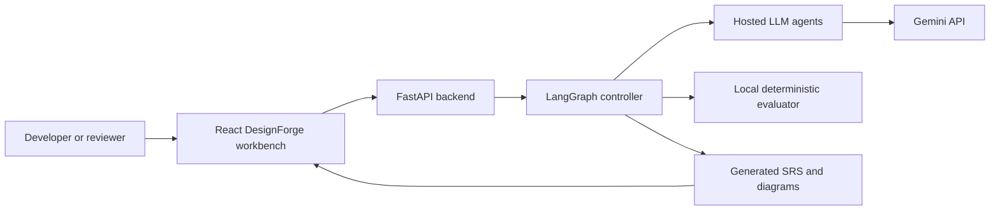

This diagram shows the external user, browser interface, backend API, orchestration layer, hosted model, local evaluator, and generated documentation. The main design principle is that reasoning is hosted while orchestration and verification remain local.

### 21.2 Five-Agent Workflow

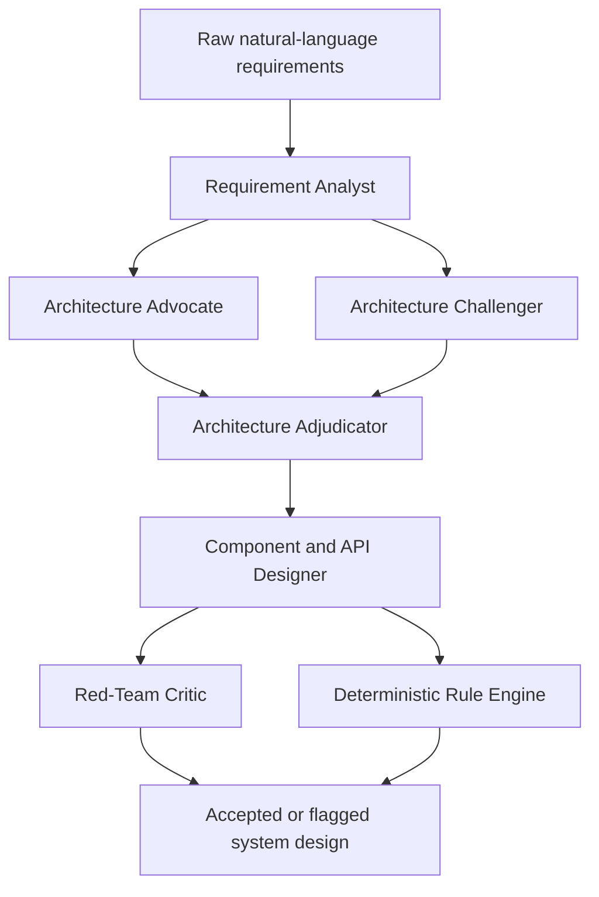

The analyst creates the structured requirement model first. The advocate and challenger then evaluate architecture independently. The adjudicator combines their results before the detailed design is produced.

### 21.3 Parallel Architecture Debate

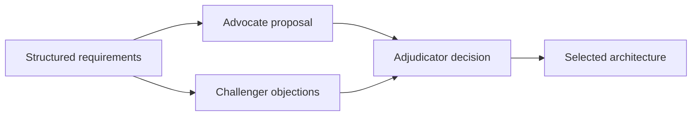

The two middle agents operate in parallel because both depend only on the structured requirements. This reduces unnecessary waiting and creates a meaningful debate instead of a single unchallenged proposal.

### 21.4 LangGraph Revision Loop

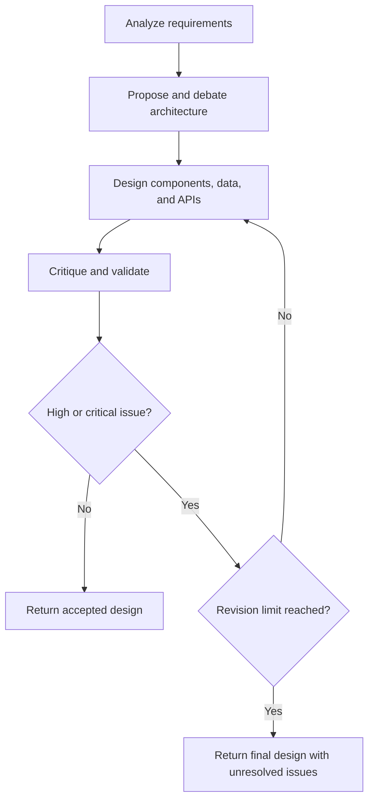

The loop prevents a flawed design from being accepted without review. The revision limit controls cost, latency, and the possibility of endless regeneration.

### 21.5 Data Transformation Flow

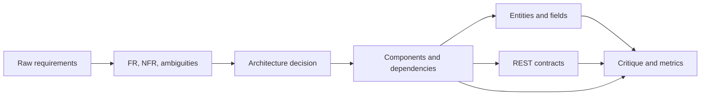

This is the data lineage of one generation run. Every stage adds structure and makes the result easier to inspect and evaluate.

### 21.6 Generated Backend Component Architecture

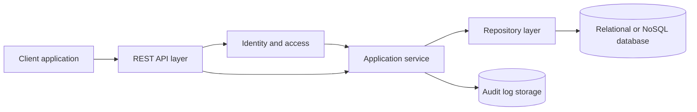

This represents the type of target backend architecture that DesignForge generates. Identity and audit storage appear when the requirements contain authentication, authorization, administrator roles, or auditability concerns.

### 21.7 API and Data Model Relationship

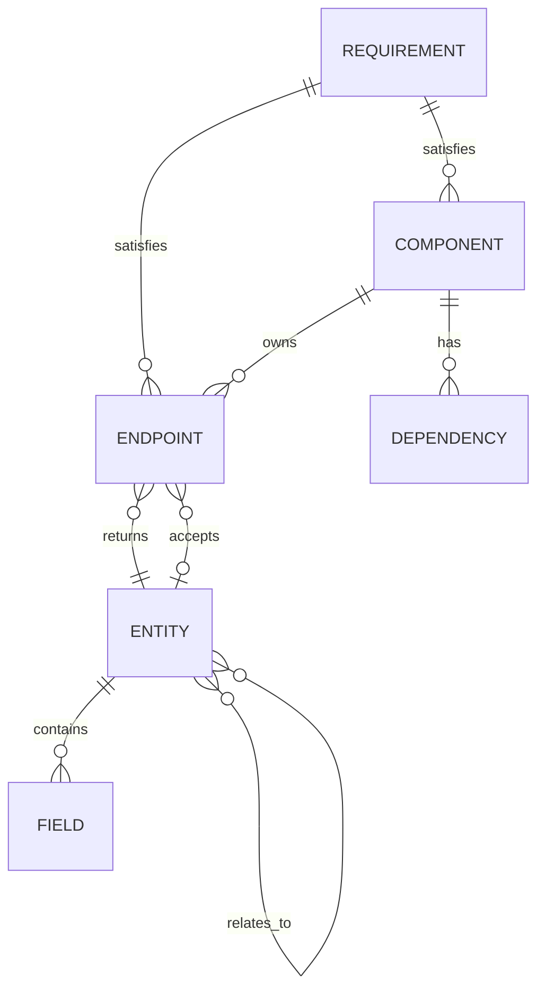

This diagram explains how requirements connect to components and endpoints, and how endpoints connect to data entities. These relationships form the basis of traceability and structural validation.

### 21.8 Hosted and Local Deployment Boundary

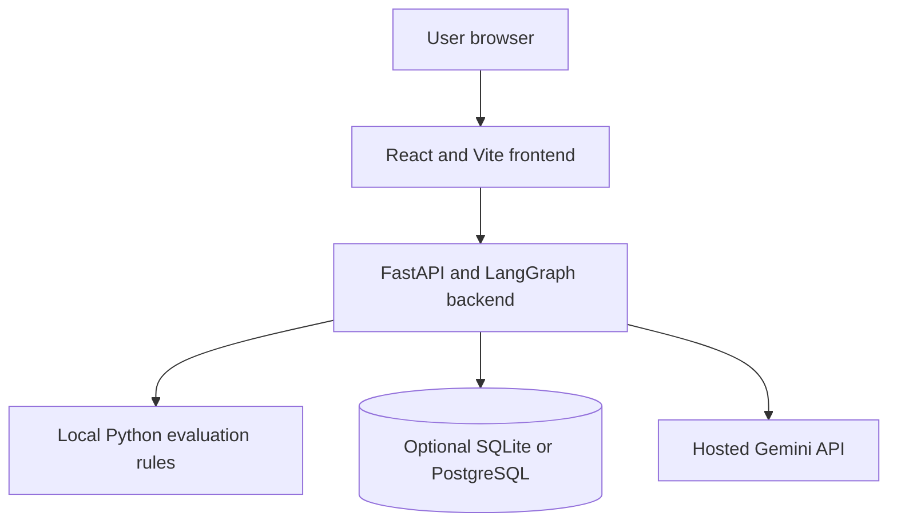

The browser, frontend, backend, rule engine, and optional database can run on the developer machine. Only generative reasoning is sent to the hosted model provider in hosted mode.

### 21.9 Evaluation and Baseline Comparison

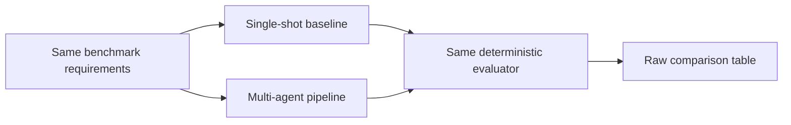

The baseline comparison is necessary to test whether the multi-agent workflow improves measurable reliability over a single prompt. Both systems must use the same input cases and evaluator.

### 21.10 Security Boundary

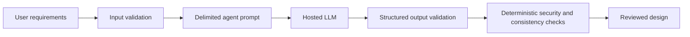

This security flow shows that user input is validated before being sent to the provider, model output is validated before downstream use, and deterministic checks are applied before the result is accepted.

### 21.11 Change Request Regeneration

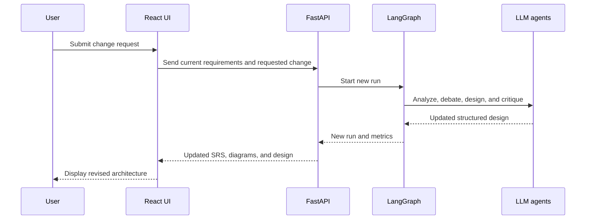

The change request does not modify only one visual field. It starts a new controlled generation run so that all related artifacts remain synchronized.

### 21.12 Diagram Summary

| Diagram | Purpose |
|---|---|
| Complete system context | Explains the overall product boundary |
| Five-agent workflow | Explains responsibilities and order |
| Parallel architecture debate | Explains concurrent advocate and challenger roles |
| LangGraph revision loop | Explains critique-driven regeneration |
| Data transformation flow | Explains how raw input becomes structured design |
| Backend component architecture | Explains the generated target system |
| API and data model relationship | Explains entities, endpoints, and traceability |
| Deployment boundary | Explains CPU-local and hosted responsibilities |
| Evaluation comparison | Explains baseline versus multi-agent testing |
| Security boundary | Explains validation and external-provider boundaries |
| Change request sequence | Explains iterative redesign |

These diagrams should be used in the project report and presentation together with the corresponding explanations. The most important diagrams for a viva are the five-agent workflow, parallel architecture debate, LangGraph revision loop, deployment boundary, and evaluation comparison.
