# DesignForge
## Technical Explanation of the B.Tech Capstone Project

**Project title:** AI-Driven Multi-Agent Framework for Automated Requirements-to-System Design  
**Project type:** Final-year B.Tech Computer Engineering capstone with Cybersecurity Honors  
**Application name:** DesignForge  
**Document purpose:** Technical explanation for project review, report preparation, and viva presentation

---

## 1. Project Overview

DesignForge is an AI-assisted software architecture workbench. It accepts informal software requirements written in natural language and transforms them into a structured backend system design.

The generated design can contain:

- Functional requirements
- Non-functional requirements
- Ambiguities and possible conflicts
- Architecture recommendations
- Parallel application, data, security, and operations discipline analyses
- Explicit design/coupling variables and an evidence-backed feasibility report
- Architecture trade-offs
- Components and dependencies
- Database entities and fields
- REST API endpoints
- Requirement traceability links
- Critique findings
- Deterministic quality scores
- Mermaid-based diagrams
- A dynamically generated Software Requirements Specification document

The main purpose of the project is not simply to ask an LLM to generate an architecture. The main purpose is to divide the design task among specialized agents and independently verify whether the generated design is complete, traceable, and internally consistent.

The system is designed for backend architectures of web applications. Its scope includes REST APIs, GraphQL-oriented services, relational and NoSQL data stores, modular monoliths, and microservice architectures.

---

## 2. Problem Statement

Software requirements are frequently written in an informal and incomplete form. They may contain vague phrases such as fast, secure, scalable, or user-friendly without measurable definitions. They may also omit important architecture information, such as authentication, auditability, data consistency, or expected scaling behavior.

Converting these requirements into a system design normally requires an experienced software architect. Small teams and student projects may not have access to that expertise. As a result, design problems are often discovered later during implementation.

A conventional single-prompt AI system has several weaknesses:

- It may combine requirement analysis and architecture selection into one opaque response.
- It may overlook ambiguous requirements.
- It may introduce components that are not required.
- It may produce endpoints that refer to nonexistent database entities.
- It may fail to connect design decisions to the original requirements.
- It may praise its own design without performing an independent review.

DesignForge addresses these weaknesses through specialized agents, structured outputs, architecture debate, independent critique, deterministic validation, and a bounded revision loop.

---

## 3. Project Objectives

### 3.1 Primary objective

To develop a multi-agent generative AI system that converts informal backend requirements into an explainable, traceable, and structurally validated system design.

### 3.2 Supporting objectives

1. Extract functional and non-functional requirements from natural language.
2. Detect ambiguity and uncertainty before architecture decisions are made.
3. Reconcile application, data, security, and operations decisions through MDF-style system-level synthesis.
4. Compare architecture choices instead of using a fixed default.
5. Generate components, dependencies, entities, and API contracts.
6. Maintain links between requirements and design elements.
7. Use an independent critic to challenge the generated design.
8. Use deterministic code to check objective structural properties.
9. Revise the design when feasibility constraints fail.
10. Generate an SRS document dynamically from the current run.
11. Support CPU-only execution through hosted LLM APIs.
12. Provide reproducible demo behavior when a hosted provider is unavailable.
13. Establish measurable evaluation criteria instead of relying only on subjective impressions.

---

## 4. Scope of the Project

### 4.1 Included scope

DesignForge covers the early requirements-to-architecture phase of backend system development.

The system supports:

- Natural-language requirement input
- Requirement classification
- Ambiguity identification
- Architecture comparison
- Modular monolith recommendations
- Microservice recommendations when justified
- Relational database recommendations
- NoSQL database recommendations
- Component and dependency design
- Entity and field design
- REST endpoint design
- Requirement traceability
- Automated structural validation
- LLM-based architecture criticism
- Revision requests
- Mermaid diagram generation
- Dynamic SRS generation
- Browser-based demonstration

### 4.2 Excluded scope

The following capabilities are outside the current project boundary:

- Generating complete production source code for the target application
- Automatically deploying the target application to cloud infrastructure
- Proving that an architecture is production-correct
- Performing formal security certification
- Training a new large language model
- Hosting a large language model locally
- Automatically executing database migrations
- Replacing human architecture review
- Guaranteeing regulatory or legal compliance

---

## 5. Novelty and Academic Contribution

The novelty of DesignForge lies in the controlled interaction between multiple specialized reasoning roles.

A conventional system generally follows this pattern:

**Requirements to one generated design**

DesignForge follows a more rigorous process:

**Requirements to analysis to competing architecture proposals to adjudication to detailed design to independent critique to deterministic validation to revision**

The academic contribution includes:

- Multi-agent decomposition of the requirements-to-design task
- Parallel architecture advocate and challenger roles
- Architecture adjudication based on competing proposals
- Schema-constrained outputs
- Explicit requirement-to-design traceability
- Independent red-team critique
- Deterministic quality gates
- Dynamic generation of technical documentation
- Reproducible fallback execution
- A framework suitable for baseline comparison and ablation studies

The project can therefore be presented as an engineering and evaluation framework, rather than only as a chatbot interface.

### Research basis and adaptation

This design adapts the architecture described in “Developing an intelligent systems design framework based on multidisciplinary design analysis and multi-agent thinking integration” (Ebrahimi, Bataleblu, and Roshanian, *Expert Systems with Applications*, 248 (2024), article 123363; DOI: 10.1016/j.eswa.2024.123363). The paper models agents as disciplines, exchanges coupling information, formulates system objectives/design variables/constraints, and uses an MDF workflow with system-level optimization. Its case study additionally reuses prior UAV search missions through normalized cross-correlation (NCC) on probability maps.

DesignForge applies the transferable coordination pattern: parallel software architecture disciplines provide recommendations and coupling variables; an MDF-style system optimizer synthesizes those with the architecture debate; deterministic rules measure objectives and enforce traceability/reference constraints; and the existing bounded design loop retries infeasible output. The objectives are requirement traceability and structural consistency (maximize), and the rate of components lacking requirement tags (minimize). The report includes measured values and evidence rather than asking the LLM to invent scores.

The paper's UAV flight model, spatial probability maps, NCC template matcher, and NSGA-II numerical search are intentionally not copied. They solve a different optimization domain; the current software-design workflow has no calibrated numeric simulation landscape or persistent history store. A future history-reuse feature would need an appropriate text/architecture retrieval method and explicit local data-retention controls rather than treating NCC as a generic similarity algorithm.

### Research-to-implementation mapping

The research contribution is implemented as an adaptation of the paper's coordination architecture, not as a reproduction of its UAV optimization experiment.

| Research concept | DesignForge implementation | Effect on the design workflow |
|---|---|---|
| Model specialized agents as disciplines | Four parallel software architecture disciplines analyze application structure, data, security, and operations after requirements have been extracted. | Each discipline returns a scoped recommendation, applicable requirement constraints, and decisions other disciplines need to share. |
| Exchange multidisciplinary coupling information | `DisciplineAnalysis.coupling_variables` records decisions such as architecture style, component boundaries, storage choice, consistency boundary, identity boundary, and deployment boundary. The report also records generated requirement IDs, components, dependency edges, and API/entity references. | Architectural choices are treated as connected decisions rather than isolated agent outputs. The component/API designer receives the discipline analyses and selected architecture as context. |
| Use an MDF system-level synthesis step | The system-level optimizer/adjudicator receives all discipline recommendations together with the advocate proposal and challenger objections, then selects a coherent architecture and records its rationale and rejected alternative. | The detailed component, API, and entity design is based on a reconciled architecture decision rather than an unreviewed proposal from one agent. |
| Define objectives and constraints | The MAMDO report measures requirement traceability and structural consistency as maximize objectives and the untraceable-component rate as a minimize objective. It also records traceability, valid component edges, valid API/component/entity references, and an acyclic dependency graph as feasibility constraints. | Objective values come from local rule checks and include evidence; a language model is not asked to fabricate metric values. |
| Iterate when a design is infeasible | The independent critic combines with deterministic checks to decide whether a revision is needed. LangGraph feeds issue summaries back into the component/API design stage and stops at the configured revision bound. | The workflow can repair omissions and structural defects while preserving a predictable upper bound on design passes. |
| Tailor domain-specific optimization | The system generates requirement-derived entities, endpoints, components, and diagrams from the current run. | The design outputs describe the user's requested system, not DesignForge's own implementation architecture. |

In this implementation, “optimizer” means constrained, model-assisted synthesis followed by deterministic verification. It does **not** mean that a numerical optimizer searches a calibrated objective landscape: there is no NSGA-II population, fitness evaluation, or Pareto-front computation. The report's design variables describe the selected style, data store, and generated artifact counts; its objective values are measurements of the resulting design. The hard feasibility constraints are requirement traceability, valid component edges, valid API component and entity references, and an acyclic component graph. The consistency objective additionally includes the deterministic meaningful/domain-specific-design check.

The architecture diagram and SRS generation are downstream presentation steps. They consume the structured results of the current run and do not participate in selecting or optimizing the architecture.

---

## 6. High-Level System Architecture

The system consists of five major layers.

### 6.1 User interface layer

The React frontend provides:

- Requirements editor
- Agent execution status
- Architecture decision view
- Architecture debate view
- Component and API view
- Data model view
- Critique report
- SRS document view
- System design view
- Change-request page
- Mermaid diagram preview
- Inline rendering of the run-specific SRS and system-design content; no Markdown download is required
- Progressive HLD/LLD diagram explorer with use-case selection and requirement-to-artifact evidence
- Expandable Mermaid source for the selected diagram
- Persistent bottom-right chat for current-design Q&A and natural-language change requests

### 6.2 API layer

The FastAPI backend exposes HTTP endpoints for:

- Health checking
- Complete design generation
- Stage-level requirement analysis
- Natural-language change requests
- Design-context chat; direct requirement/API/component matches remain available when the hosted model is unavailable

The API validates input and returns a structured run response.

### 6.3 Orchestration layer

LangGraph controls the sequence of agent execution and maintains the shared pipeline state.

The orchestration layer is responsible for:

- Passing validated data between agents
- Executing independent architecture agents concurrently
- Routing the result to the adjudicator
- Sending the design to the critic
- Looping back when revision is necessary
- Limiting the number of revisions
- Returning a final accepted or flagged design

### 6.4 LLM provider layer

The provider adapter hides the details of the hosted model API from the agents.

The current provider configuration supports Google Gemini through HTTP requests. The design also permits future providers such as Groq or another hosted model service.

### 6.5 Deterministic evaluation layer

The rule engine executes locally and independently of the LLM. It checks measurable properties such as:

- Requirement coverage
- Traceability tags
- API entity references
- Component edge references
- Dependency graph validity
- Over-engineering indicators

This separation makes the evaluation more defensible during a viva.

---

## 7. Multi-Agent Architecture

### 7.1 Requirement Analyst

The Requirement Analyst is responsible for understanding the raw user input.

Its responsibilities are:

- Segmenting the input into requirement statements
- Classifying statements as functional or non-functional
- Assigning stable identifiers
- Estimating confidence
- Detecting vague language
- Identifying requirements that need measurable acceptance criteria
- Preserving links to the original text

The analyst does not make architecture decisions. This boundary is important because architecture should be based on a structured requirement model rather than on an unprocessed paragraph.

### 7.2 Architecture Advocate

The Architecture Advocate proposes a design that satisfies the requirements with the lowest reasonable operational complexity.

It evaluates:

- Team size assumptions
- Transactional consistency
- Deployment complexity
- Data ownership
- Scaling requirements
- Latency requirements
- Security requirements
- Maintenance effort

The advocate may recommend a modular monolith when the requirements do not justify distributed services.

### 7.3 Parallel Architecture Disciplines

After requirement analysis, application architecture, data, security, and operations disciplines run concurrently. Each returns a recommendation, requirement constraints, and explicit coupling variables that other disciplines must consider. These are inputs to system-level synthesis, not independent final designs. In demo mode, local deterministic analyses provide the same structured outputs.

### 7.4 Architecture Challenger

The Architecture Challenger independently questions the simplest proposal.

It searches for:

- Hidden scaling requirements
- Missing security boundaries
- Strong consistency requirements
- Independent deployment needs
- Fault isolation concerns
- Potential bottlenecks
- Unnecessary complexity
- Missing architecture components

The challenger is deliberately separated from the advocate to reduce confirmation bias within a single generated response.

### 7.5 MDF-Style System Optimizer and Adjudicator

The system-level optimizer reconciles discipline recommendations and coupling variables with the advocate proposal and challenger objections. It performs constrained synthesis: complete requirement traceability, valid component/API/entity references, and an acyclic dependency graph are hard constraints. Among feasible designs, it considers measured traceability and consistency while minimizing untraceable components.

It selects the final architecture by considering:

- Requirement satisfaction
- Technical risks
- Complexity
- Scalability
- Security
- Data consistency
- Team and deployment assumptions

The adjudicator also records the rejected alternative and explains why it was not selected. The returned MAMDO report records design variables, coupled references, measured objectives with evidence, constraint results, and the number of design passes. This is an MDF-inspired software architecture workflow, not the paper's numeric NSGA-II optimizer.

### 7.6 Component and API Designer

The Component and API Designer translates the selected architecture into implementation-oriented artifacts.

Its responsibilities are:

- Defining components
- Defining component dependencies
- Defining data entities
- Defining fields and types
- Defining relationships
- Defining REST endpoints
- Assigning component ownership to endpoints
- Adding requirement identifiers to design elements
- Preserving architectural traceability

### 7.7 Red-Team Critic

The Red-Team Critic attempts to identify weaknesses in the generated design.

It reviews:

- Missing requirements
- Untraceable components
- Unjustified services
- Invalid database references
- Security gaps
- API inconsistencies
- Scaling risks
- Conflicting design decisions
- Missing acceptance criteria

The critic is advisory from an AI perspective, but deterministic rule failures always remain binding.

### 7.8 Revision Controller

The Revision Controller determines whether the design is complete enough to return to the user.

A revision is requested while a blocking issue or deterministic feasibility constraint remains and the configured revision limit permits it. Hard constraints require complete requirement traceability, valid component edges and API entity references, and an acyclic dependency graph. The percentage of components without requirement tags is reported as a soft minimization objective, not a hard feasibility constraint.

The critic feedback is passed back to the design stage so that the next version can address the identified issues.

---

## 8. Parallel Processing Strategy

Not all agents are dependent on each other.

The Requirement Analyst must finish first. Application, data, security, and operations discipline analyses then run concurrently; the Architecture Advocate and Challenger run concurrently as well. The optimizer waits for both groups and reconciles their shared decisions.

Therefore, they are executed in parallel.

This improves performance because:

- Each discipline works from the same structured requirements and returns explicit coupling variables.
- The advocate does not wait for the challenger, and the discipline agents do not wait on one another.
- The optimizer receives all completed recommendations and debate results before detailed design.

The dependency structure is:

| Stage | Dependency |
|---|---|
| Requirement analysis | Raw requirements |
| Discipline analyses | Structured requirements |
| Advocate and challenger | Structured requirements |
| MDF system optimizer | Discipline, advocate, and challenger results |
| Component/API design | Adjudicated architecture |
| Critique | Complete design and requirements |
| Revision | Critique result |
| Final artifact | Accepted or final flagged design |

This is a dependency-aware form of parallelism rather than running every agent at the same time without context.

---

## 9. End-to-End Data Flow

### Step 1: User input

The user enters free-form requirements in the Workbench page.

### Step 2: Input validation

The FastAPI endpoint checks that the request contains enough text to be meaningful.

### Step 3: Requirement analysis

The Requirement Analyst returns structured requirements and ambiguity records.

### Step 4: Parallel architecture reasoning

The advocate and challenger independently evaluate the structured requirements.

### Step 5: Architecture adjudication

The adjudicator selects one architecture and records the reasoning.

### Step 6: Detailed design generation

The Component/API Designer generates:

- Components
- Edges
- Entities
- Fields
- Relationships
- Endpoints
- Traceability tags

### Step 7: Critique

The Red-Team Critic and deterministic rules review the design.

### Step 8: Revision decision

The controller either:

- Accepts the design
- Sends it back for revision
- Returns the final design with unresolved issues if the revision limit is reached

### Step 9: Artifact generation

The system produces:

- JSON run response
- Backend-generated target-system Markdown with Mermaid diagrams and validation summary
- Frontend-generated, run-specific System Design and SRS Markdown rendered inline in the browser
- Mermaid SVG diagrams derived from the current requirements, architecture, components, APIs, and entities
- Quality metrics

The backend's `diagram_markdown` and the frontend's SRS/System Design documents are related but distinct artifacts. The backend Markdown provides a deterministic target-system diagram package and validation summary. The frontend builds the fuller document from the run response, adding the requirement text, architecture decision and alternative, generated tables, explanations of each diagram, and validation results.

---

## 10. Structured Data Model

### 10.1 Requirement model

Each requirement contains:

- Identifier
- Original text
- Requirement type
- Confidence

### 10.2 Ambiguity model

Each ambiguity contains:

- Ambiguity identifier
- Explanation
- Confidence
- Related requirement identifiers

### 10.3 Architecture model

The architecture record contains:

- Selected architecture style
- Justification
- Trade-offs
- High-level component identifiers
- Database style
- Database justification
- Decision traceability

### 10.4 Component model

Each component contains:

- Identifier
- Human-readable name
- Component type
- Requirement identifiers it satisfies

### 10.5 Edge model

Each edge contains:

- Source component
- Target component
- Relationship label

### 10.6 Entity model

Each entity contains:

- Entity name
- Fields
- Relationships
- Requirement identifiers

### 10.7 Endpoint model

Each endpoint contains:

- HTTP method
- URL path
- Owning component
- Request entity
- Response entity
- Requirement identifiers

### 10.8 Use-case model

Each generated use case contains:

- Human-readable actor goal
- Primary actor, or an explicit marker when the actor is unspecified
- Preconditions and policy decisions that remain open
- Ordered main-flow steps tied to generated endpoints and components
- Postconditions
- Source requirement identifiers
- API operation references

Use cases are derived from functional requirements and the generated design. They are explanatory flows, not proof that unspecified business rules have been elicited.

### 10.9 Design assumptions

The design records inferred fields and domain relationships separately as assumptions. For example, an order-to-product association can be shown as an `OrderItem`, while payment, tax, inventory reservation, and fulfilment are called out for confirmation rather than silently included as requirements.

### 10.10 Critique model

The critique contains:

- Acceptance status
- Issues
- Severity
- Issue category
- Related identifiers
- Rule-based metrics
- Summary

---

## 11. API Specification

### Health endpoint

The health endpoint is used to confirm that the backend service is running and to identify the active provider mode.

### Generation endpoint

The generation endpoint accepts raw requirements and returns the complete design package.

The response includes:

- Run identifier
- Requirements
- Architecture
- Architecture debate
- Design
- Critique
- Revision count
- Diagram Markdown

### Change endpoint

The change endpoint accepts the existing requirements and a new natural-language modification.

The system then regenerates the complete design. This is preferable to changing a single component in isolation because an architecture change may affect requirements, APIs, entities, diagrams, and the SRS document.

### Stage analysis endpoint

The stage analysis endpoint allows the requirement extraction result to be inspected independently.

---

## 12. Frontend Technical Design

The frontend is implemented with React and Vite.

### Workbench page

The Workbench is the primary user interaction page. It contains:

- Requirement editor
- Generate button
- Pipeline status
- Requirement analysis results
- Architecture decision
- Debate evidence
- Component graph
- Data model
- Critique results
- Endpoint traceability

### System Design page

This page focuses on visual explanation of the architecture.

It presents:

- Multi-agent workflow
- System architecture
- Data lineage
- Generated component graph
- Deployment boundary
- Evaluation flow

### SRS page

The SRS Markdown is generated in the frontend from the current run response rather than being a fixed project document. It is rendered directly on the webpage; the application does not download or save an `.md` file.

It contains:

- Run-specific title
- Source requirement set
- Functional requirements
- Non-functional requirements
- Requirement ambiguities
- Actor-goal use-case walkthroughs with main flows and API references
- Selected architecture and data-store rationale
- A considered alternative and trade-offs
- Generated components, API contracts, and data entities
- Requirement-to-component/API/entity traceability matrix
- Explicit design assumptions and open acceptance decisions
- Requirement-derived HLD and LLD Mermaid catalogs: architecture and context, component and deployment, DFD, ER/schema, sequence/activity/use case/state, network/API/data/infrastructure, scalability/load balancing/cache/queue, class/object/communication/package/interface/design-pattern/flowchart/algorithm/CRC/dependency views
- A reason for using each diagram and why a plausible alternative view was not selected; views that lack requirement evidence explicitly show open decisions instead of fabricating behavior or infrastructure
- A deployment recommendation matrix and target deployment diagram that distinguish Docker/OCI, managed hosting, persistence, HTTPS ingress, and CI/CD recommendations from user-mandated technology choices
- An explicit architecture debate record: advocate proposal, requirement-anchored challenger objections, advocate response, accepted/deferred objections, and final adjudication
- Deterministic validation metrics and the critic summary

### Change Request page

This page allows the user to request modifications in plain language.

Examples include:

- Add authentication
- Add audit logging
- Add independent notification scaling
- Add role-based access control
- Add delivery tracking

After applying a request, the entire design is regenerated to preserve consistency.

---

## 13. Mermaid and Markdown Artifact Generation

The backend creates `diagram_markdown` deterministically from the generated architecture, component graph, API contracts, entity model, and rule-check results. The frontend produces the complete HLD/LLD diagram set from the same structured run response, including recommendation-aware deployment, sequence, state, interaction, schema, and dependency views. Diagram inputs use the generated user goals, requirement IDs, endpoint paths, component names, field lists, and relationship declarations; unsupported lifecycle, network, and scaling details are surfaced as unresolved rather than invented.

The local demo fallback splits coordinated action clauses into separate atomic requirements, assigns separate `FR-*` and `NFR-*` sequences, and flags unquantified quality attributes for acceptance-criteria clarification. It derives capability services, REST operations, candidate domain fields, and (when required) audit records from the submitted domain terms. Inferred fields and relationships are marked as assumptions so they are not confused with user-approved requirements. These deterministic heuristics are intentionally a demonstration fallback; complex language still requires stakeholder review and hosted model reasoning.

The frontend independently creates the System Design document and SRS Markdown in memory from the same run response. The architecture advocate and challenger prompts require requirement-anchored decisions and objections; the adjudicator returns a point-by-point response and separates accepted objections from deferred ones with evidence needed. Deployment recommendations are labeled as recommendations or open choices—not as requirements—and the diagrams show the selected data-store category without pretending a vendor, cloud, region, or capacity was chosen. Both documents include actor-goal flows, requirement-to-component/API/entity mappings, assumptions, debate evidence, deployment rationale, and measured structural checks. This keeps the displayed target-system design distinct from diagrams of DesignForge's own internals. Off-screen Mermaid diagrams render lazily to avoid doing all SVG layout work before the user reaches each view.

`MarkdownDocument` renders Markdown headings, paragraphs, lists, tables, and Mermaid fenced blocks in the page. Each Mermaid block is rendered to an SVG by Mermaid, with its source available through an expandable disclosure. Mermaid is loaded lazily and configured with strict security settings. No downloadable or persisted `.md` file is produced by this UI; the Markdown document exists in the current frontend run state and remains visible in the webpage.

The structured JSON run response is the source of truth. Backend and frontend Markdown are presentation artifacts derived from it, not independent architecture models. A changed requirement starts a new run and regenerates the structured design, use cases, assumptions, and diagrams together.

---

## 14. Evaluation Framework

DesignForge is intended to be evaluated against a single-shot baseline.

The reported feasibility flag means that the declared deterministic structural constraints pass. It does not establish complete requirement discovery, measured performance, security assurance, or production readiness. Unquantified non-functional requirements and design assumptions are surfaced as review items, not counted as satisfied merely because the graph is structurally valid.

### 14.1 Requirement coverage

Measures how many extracted requirements appear in at least one component or endpoint mapping.

### 14.2 Traceability percentage

Measures the fraction of requirements that have explicit links to generated design elements.

### 14.3 Consistency score

Measures whether:

- API entities exist
- Component edge references exist
- Dependency relationships are valid
- The design remains structurally coherent

### 14.4 Over-engineering rate

Measures the proportion of components that have no explicit requirement mapping.

### 14.5 LLM quality assessment

A separate LLM judge may evaluate:

- Clarity
- Soundness
- Quality of justification
- Completeness

However, the LLM judge should remain a secondary metric. Deterministic rules are more defensible for objective structural checks.

### 14.6 Baseline comparison

The recommended experiment compares:

- A single prompt with no specialist agents
- The complete multi-agent pipeline

Both systems should receive the same benchmark requirements and be evaluated using the same rule engine.

Results should report:

- Number of test cases
- Coverage percentage
- Traceability percentage
- Consistency percentage
- Over-engineering rate
- Number of failed cases
- Model and provider
- Prompt version
- Execution date

---

## 15. Security Considerations

The project includes several cybersecurity-relevant considerations.

### Secret protection

API keys must be stored in environment variables and excluded from Git.

### Hosted data awareness

Requirements may contain confidential information. Users should understand that hosted mode sends requirements to an external provider.

### Input validation

The API validates request shape and minimum input length.

### Output validation

LLM outputs are parsed and validated before they are used by downstream stages.

### Prompt injection awareness

User requirements must be treated as input data rather than trusted instructions. Agent prompts should clearly separate system instructions from user content.

### Rate and cost control

The system uses bounded retries and a maximum revision count to control provider cost and latency.

### Architecture security

The challenger and critic specifically look for authentication, authorization, audit logging, data exposure, and insecure service boundaries.

---

## 16. Deployment Specification

### Local deployment

The backend runs as a FastAPI service using Uvicorn.

The frontend runs as a Vite development server.

### Hosted deployment

The project contains Vercel configuration for:

- Frontend service
- FastAPI backend service
- Backend Python entrypoint
- API rewrite routing

The backend entrypoint is the FastAPI application module.

The frontend can use an environment variable to select the backend URL. In a same-domain deployment, `/api` can be used as the frontend API base path.

### Runtime constraints

- CPU-only local machine
- Hosted reasoning provider
- Local orchestration
- Local schema validation
- Local deterministic evaluation
- Browser-based visualization

---

## 17. Current Implementation Status

### Implemented

- FastAPI service
- React and Vite frontend
- LangGraph pipeline
- Requirement analyst role
- Architecture advocate role
- Architecture challenger role
- Architecture adjudicator role
- Component/API design role
- Red-team critique role
- Parallel advocate and challenger execution
- Retry handling
- Deterministic fallback mode
- Structured Pydantic models
- Traceability evaluation
- Consistency checks
- Dynamic SRS generation
- Requirement-specific Mermaid Markdown for the generated design and SRS, rendered inline in the browser
- Diagram explanations and rationale for not choosing alternative representations
- Change-request regeneration
- Vercel deployment configuration
- Project documentation

### Partially implemented or requiring further research work

- Persistent run history
- Full conflict detection
- Complete single-shot baseline runner
- Large hand-verified benchmark set
- SSE-based live progress streaming
- Full database persistence
- Formal security test suite
- Calibrated confidence scores
- Independent human evaluation

These limitations should be stated honestly in the final academic report.

---

## 18. Suggested Demonstration Flow

1. Open the Workbench.
2. Enter a simple e-commerce requirement set.
3. Generate the architecture.
4. Show extracted functional and non-functional requirements.
5. Show detected ambiguity.
6. Show the architecture decision.
7. Show advocate and challenger evidence.
8. Show components and database entities.
9. Show API endpoints and traceability tags.
10. Show critic acceptance and deterministic rule checks.
11. Open the System Design page.
12. Open the generated SRS page.
13. Use Request Change to add authentication or audit logging.
14. Show that a new run is generated.
15. Compare the before and after design artifacts.
16. Explain demo mode and hosted mode separately.
17. Present limitations and evaluation methodology.

---

## 19. Viva Explanation

DesignForge is a hosted-LLM-based multi-agent system that transforms natural-language backend requirements into a structured and verifiable system design.

The Requirement Analyst extracts functional and non-functional requirements and identifies ambiguities. Application, data, security, and operations disciplines analyze the requirements in parallel and expose coupled decisions. Alongside them, the Architecture Advocate proposes a design and the Challenger searches for risks. The MDF-style system optimizer adjudicates their findings under explicit structural constraints. The Component/API Designer then generates traceable components, dependencies, entities, and REST contracts. A Red-Team Critic challenges the result, while deterministic Python rules measure objectives and verify feasibility. LangGraph loops back to design while issues remain and the configured revision limit permits it.

The project is designed for CPU-only execution. Hosted Gemini provides the main generative reasoning, while local computation handles orchestration, validation, metrics, diagrams, and the user interface.

The main contribution is not merely generating an architecture with AI. It is creating a controlled, traceable, debate-based, and verifiable requirements-to-design process.

---

## 20. Final Project Claim

A technically defensible project claim is:

> DesignForge implements an MDF-inspired multi-agent requirements-to-backend-design workflow. Parallel application, data, security, and operations disciplines expose coupled decisions; a system-level optimizer synthesizes their recommendations with architecture advocacy and challenge. Deterministic local rules measure objectives and verify hard feasibility constraints, and LangGraph provides a bounded revision loop. The system produces traceable design artifacts, a MAMDO evidence report, a dynamic SRS, and diagrams.

This claim accurately describes the project without implying that the generated architecture is automatically production-ready or that the system replaces human architects.

---

## 21. Architecture Diagrams

The following diagrams document **DesignForge's own implementation architecture** for this technical explanation. They are not inserted into a user's generated SRS. The runtime SRS and System Design documents instead build their HLD and LLD Mermaid catalog from the submitted requirements and the structured design returned for that run. These technical-explanation diagrams can be rendered by Markdown viewers that support Mermaid, including GitHub and many documentation tools.

### 21.1 Complete System Context

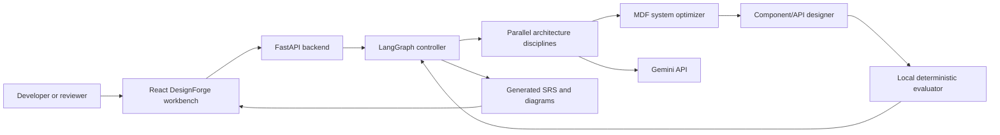

This diagram shows the external user, browser interface, backend API, orchestration layer, hosted model, local evaluator, and generated documentation. The main design principle is that reasoning is hosted while orchestration and verification remain local.

### 21.2 MDF-Inspired Multi-Agent Workflow

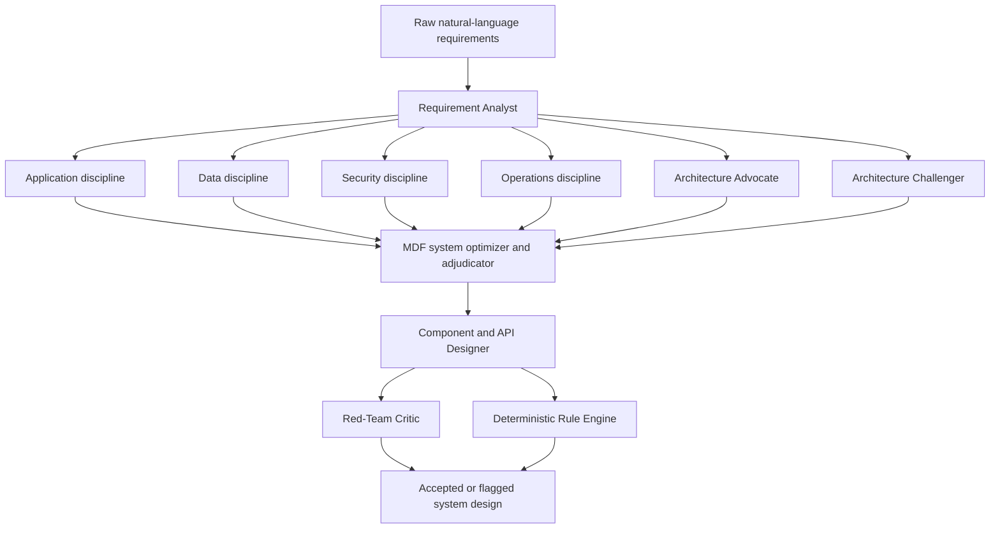

The analyst creates the structured requirement model first. The domain disciplines and architecture debate then run independently. The optimizer reconciles their coupled decisions and applies feasibility constraints before detailed design and deterministic evaluation.

### 21.3 Parallel Architecture Debate

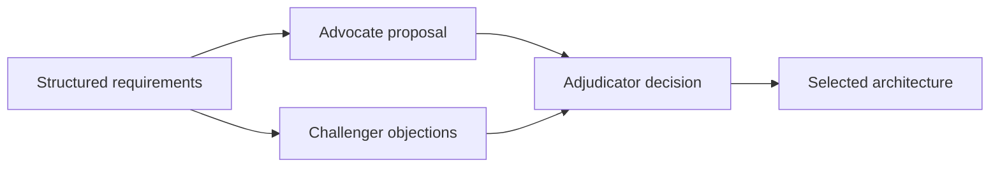

The two middle agents operate in parallel because both depend only on the structured requirements. This reduces unnecessary waiting and creates a meaningful debate instead of a single unchallenged proposal.

### 21.4 LangGraph Revision Loop

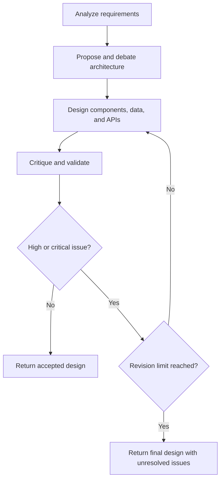

The loop prevents a flawed design from being accepted without review. The revision limit controls cost, latency, and the possibility of endless regeneration.

### 21.5 Data Transformation Flow

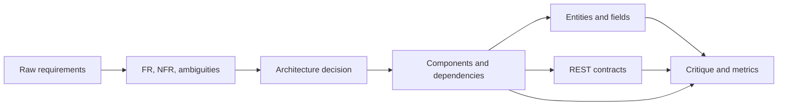

This is the data lineage of one generation run. Every stage adds structure and makes the result easier to inspect and evaluate.

### 21.6 Generated Backend Component Architecture

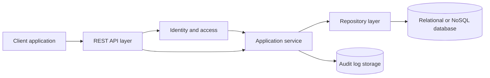

This represents the type of target backend architecture that DesignForge generates. Identity and audit storage appear when the requirements contain authentication, authorization, administrator roles, or auditability concerns.

### 21.7 API and Data Model Relationship

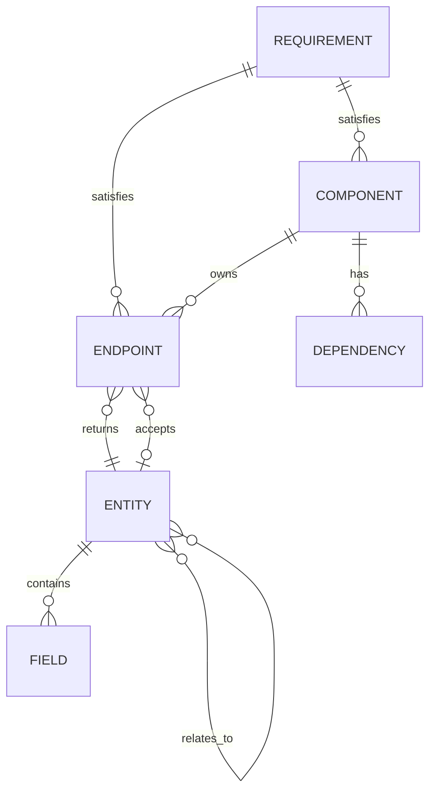

This diagram explains how requirements connect to components and endpoints, and how endpoints connect to data entities. These relationships form the basis of traceability and structural validation.

### 21.8 Hosted and Local Deployment Boundary

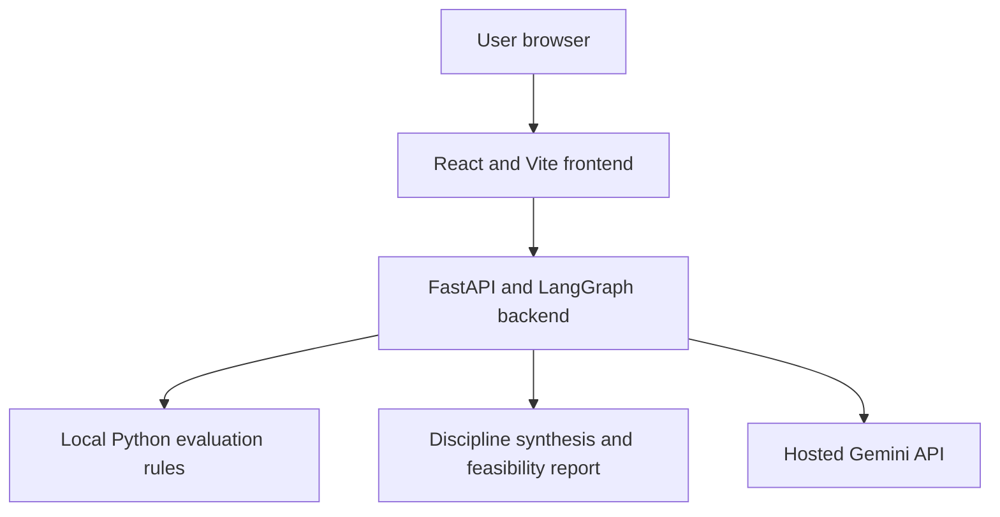

The browser, frontend, backend, rule engine, and optional database can run on the developer machine. Only generative reasoning is sent to the hosted model provider in hosted mode.

### 21.9 Evaluation and Baseline Comparison

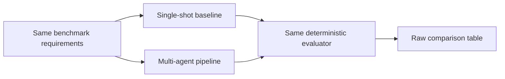

The baseline comparison is necessary to test whether the multi-agent workflow improves measurable reliability over a single prompt. Both systems must use the same input cases and evaluator.

### 21.10 Security Boundary

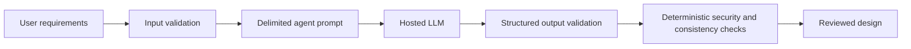

This security flow shows that user input is validated before being sent to the provider, model output is validated before downstream use, and deterministic checks are applied before the result is accepted.

### 21.11 Change Request Regeneration

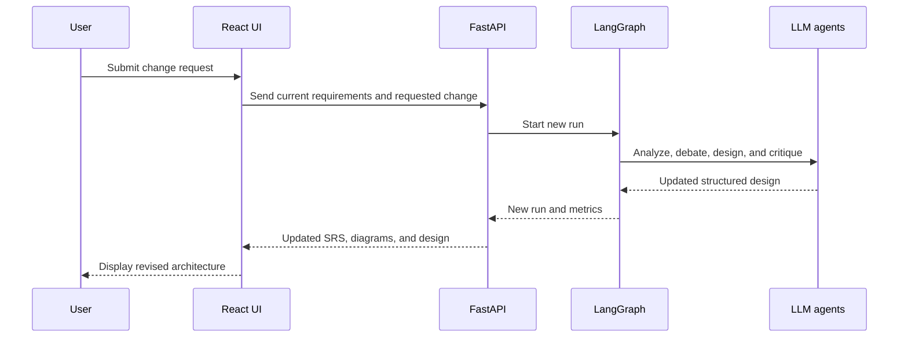

The change request does not modify only one visual field. It starts a new controlled generation run so that all related artifacts remain synchronized.

### 21.12 Diagram Summary

| Diagram | Purpose |
|---|---|
| Complete system context | Explains the overall product boundary |
| MDF-inspired multi-agent workflow | Explains responsibilities, coupling, and synthesis |
| Parallel architecture debate | Explains concurrent advocate and challenger roles |
| LangGraph revision loop | Explains critique-driven regeneration |
| Data transformation flow | Explains how raw input becomes structured design |
| Backend component architecture | Explains the generated target system |
| API and data model relationship | Explains entities, endpoints, and traceability |
| Deployment boundary | Explains CPU-local and hosted responsibilities |
| Evaluation comparison | Explains baseline versus multi-agent testing |
| Security boundary | Explains validation and external-provider boundaries |
| Change request sequence | Explains iterative redesign |

These diagrams should be used in the project report and presentation together with the corresponding explanations. The most important diagrams for a viva are the MDF-inspired workflow, parallel architecture debate, LangGraph revision loop, deployment boundary, and evaluation comparison.
